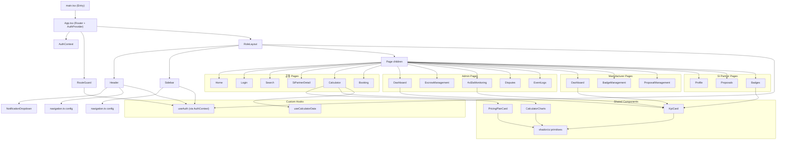

# COMPONENT_STRUCTURE.md
<!-- @AI_GUIDE: 컴포넌트 계층 구조 및 의존 관계 현황. 신규 컴포넌트 추가 시 위치 선정 기준으로 사용. -->

# 🧩 컴포넌트 구조 현황 및 개선점 분석

---

## 1. 전체 컴포넌트 계층 트리



---

## 2. 디렉토리별 역할 정의

| 경로 | 역할 | 파일 수 |
| :--- | :--- | :---: |
| `src/app/App.tsx` | 라우터 루트, 전체 Route 정의 | 1 |
| `src/app/components/layout/` | Header, Sidebar, RoleLayout, Footer, NotificationDropdown | 5 |
| `src/app/components/dashboard/` | KpiCard (공통 KPI 카드) | 1 |
| `src/app/components/calculator/` | PricingPlanCard, CalculatorCharts, QuoteRequestModal | 3 |
| `src/app/components/ui/` | shadcn/ui 래핑 컴포넌트들 | ~20 |
| `src/app/components/guards/` | RouteGuard (인증/권한 보호) | 1 |
| `src/pages/` | 공통 페이지 (Home, Login, Search, Calculator 등) | 11 |
| `src/pages/admin/` | 관리자 전용 페이지 | 5 |
| `src/pages/manufacturer/` | 제조사 전용 페이지 | 3 |
| `src/pages/partner/` | SI 파트너 전용 페이지 | 3 |
| `src/pages/as/` | AS 티켓 페이지 | 2 |
| `src/config/` | navigation.ts (역할별 메뉴/색상/라벨 중앙 설정) | 1 |
| `src/contexts/` | AuthContext (전역 인증 상태) | 1 |
| `src/hooks/` | useCalculatorData (계산기 로직 분리) | 1 |
| `src/lib/` | Mock 데이터, 유틸리티, Zod 스키마 | 다수 |

---

## 3. Props 흐름 요약

```
AuthContext
  └─ useAuth() → Header, Sidebar, RoleLayout, RouteGuard (역할 기반 분기)

navigation.ts
  └─ navigationByRole, getRoleLabel(), getRoleColor() → Header, Sidebar

useCalculatorData (Hook)
  └─ Calculator.tsx
        ├─ PricingPlanCard  (results 데이터 전달)
        └─ CalculatorCharts (results, termMonths 전달)
```

---

## 4. 현재 구조 강점

| 항목 | 내용 |
| :--- | :--- |
| **역할 분리** | 페이지 폴더를 역할별로 명확히 분리 |
| **설정 중앙화** | `navigation.ts` 하나로 전체 메뉴·색상·라벨 관리 |
| **공통 컴포넌트** | `KpiCard`로 다수 대시보드의 지표 카드 단일화 |
| **로직 분리** | `useCalculatorData` 훅으로 UI와 비즈니스 로직 분리 |
| **성능 최적화** | `React.memo`, `useMemo`, `useCallback` 적용 |

---

## 5. 개선 포인트 (Future Work)

### 🔴 우선순위 높음

| 항목 | 문제 | 권장 해결책 |
| :--- | :--- | :--- |
| **Mock → 실제 API 전환** | `lib/mock*` 데이터가 컴포넌트 안에 직접 호출 | React Query 도입, API 전용 훅으로 래핑 |
| **Path Alias 미설정** | 깊은 상대 경로(`../../app/components/...`) | `vite.config.ts` + `tsconfig.json`에 `@/` alias 설정 |

### 🟡 우선순위 중간

| 항목 | 문제 | 권장 해결책 |
| :--- | :--- | :--- |
| **shadcn/ui Sidebar 미사용** | `ui/sidebar.tsx`가 존재하나 사용 안 됨 | 현재 커스텀 Sidebar를 shadcn/ui 기반으로 교체 |
| **폼 표준화 미흡** | 회원가입·계약 폼이 개별 구현됨 | 공통 `FormField` 래퍼 컴포넌트 도입 |
| **에러 바운더리 부재** | 렌더 오류 시 전체 페이지 크래시 | React Error Boundary 추가 |

### 🟢 우선순위 낮음

| 항목 | 권장 해결책 |
| :--- | :--- |
| **테스트 코드 없음** | Vitest + React Testing Library 도입 |
| **접근성(a11y) 미검증** | axe-core 도구로 접근성 감사 수행 |
