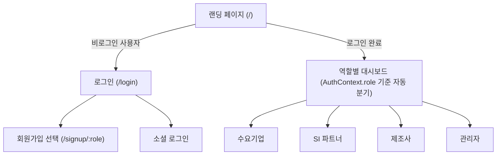
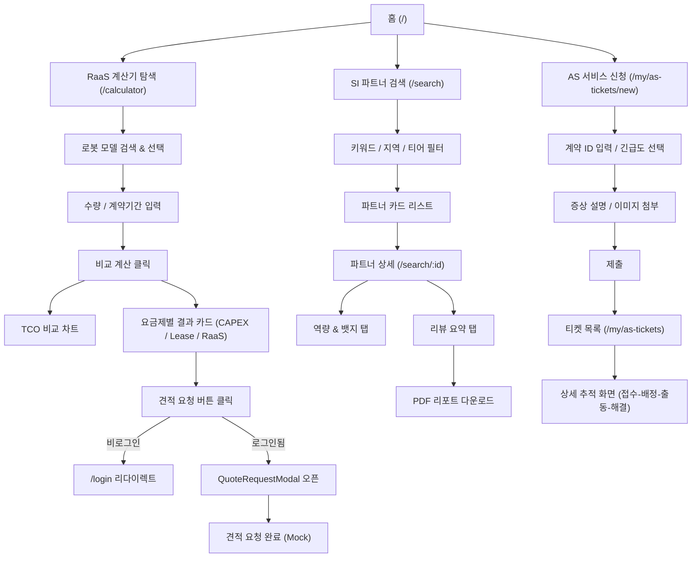
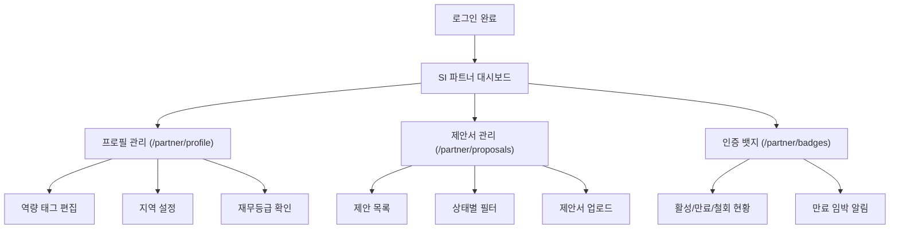
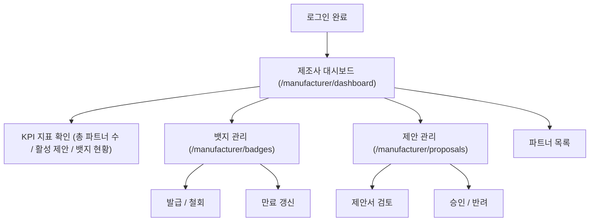
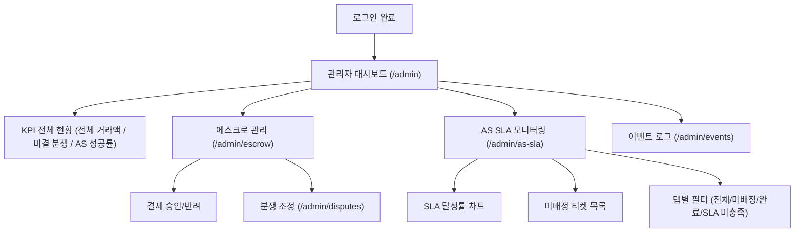
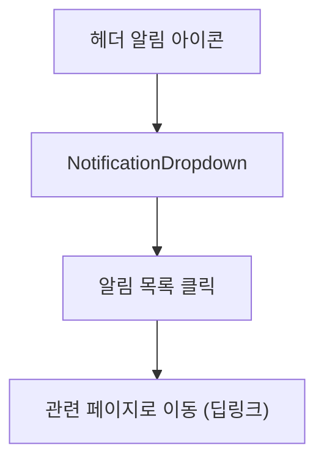
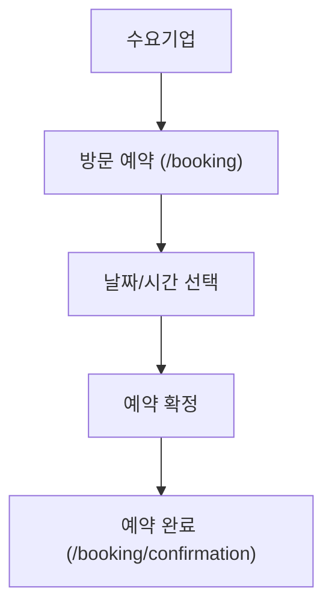
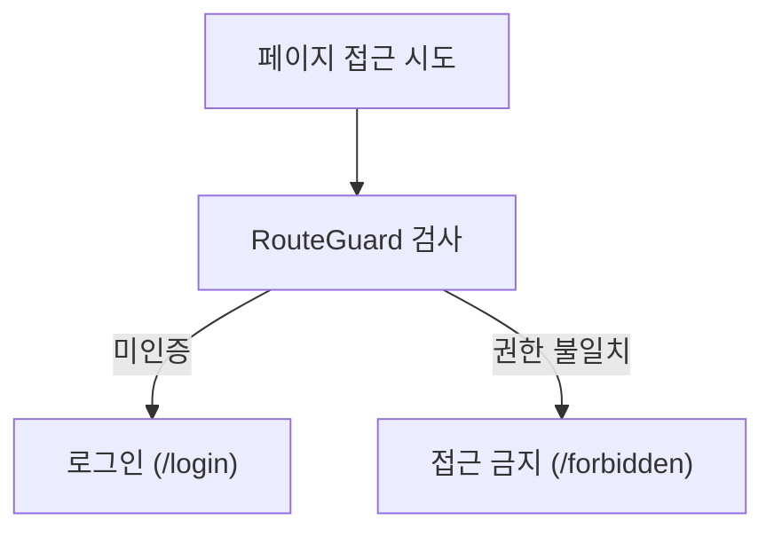

# UX_FLOW.md
<!-- @AI_GUIDE: 역할별 핵심 UX 시나리오 정의 문서. 신규 페이지 설계 또는 사용자 흐름 변경 시 반드시 참조. -->

# 🧭 UX 핵심 시나리오 흐름 (UX Flow)

본 문서는 Robot Platform Prototype V2의 역할별 핵심 사용자 시나리오(User Scenario)를 화면 이동 흐름과 함께 정의합니다.

---

## 공통 진입 흐름 (모든 역할)

---

## 시나리오 1: 수요기업 (Buyer) — 로봇 도입 탐색 및 견적 요청

**목표**: 로봇 도입 방식을 비교하고, SI 파트너를 찾아 견적을 요청한다.

---

## 시나리오 2: SI 파트너 (SI Partner) — 프로필 관리 및 제안서 운영

**목표**: 자사 역량을 등록하고, 수요기업 제안에 응대하며 인증 뱃지를 관리한다.

---

## 시나리오 3: 제조사 (Manufacturer) — 대시보드 및 파트너십 관리

**목표**: SI 파트너에게 인증 뱃지를 발급하고, 수요기업 제안서를 검토한다.

---

## 시나리오 4: 관리자 (Admin) — 플랫폼 운영 및 분쟁 조정

**목표**: 플랫폼 전체 지표를 관리하고, 에스크로 결제 및 AS SLA를 감시한다.

---

## 공통 보조 흐름

### 알림 (Notifications)

### 방문 예약 (Booking)

### 인증 보호 흐름 (RouteGuard)

